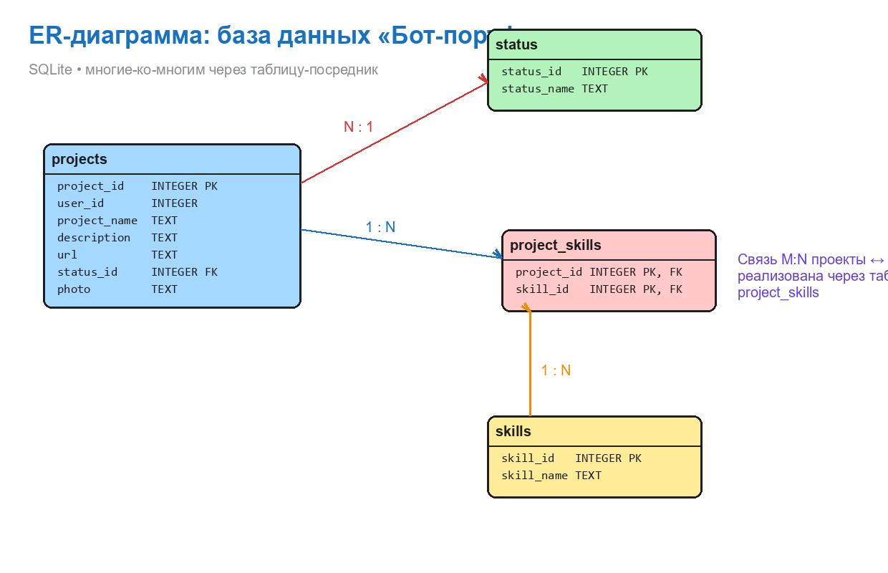

# 🤖 Бот-портфолио

> **Твой личный Telegram-сервис для хранения и демонстрации проектов и навыков!**
> Рассказывай всем о своих работах, добавляй ссылки, статусы, фото и навыки —
> всё в одном месте, прямо в Telegram! 🚀


---

## ✨ Возможности

- 📌 **Добавление проектов** — название, ссылка, статус, описание и даже фото
- 🛠 **Навыки** — привязывай к каждому проекту используемые технологии
- 📂 **Список проектов** — вся коллекция в один клик
- ✏️ **Редактирование** — меняй имя, описание, ссылку, статус и фото проекта
- 🗑 **Удаление** — наведи порядок в портфолио
- 🖼 **Фото проектов** — сохраняются в локальную папку `imgs/`

## 📸 Карточка проекта

```
📌 Project name: Сервер для майна и хостинга сайта
📝 Description: Домашний сервер на Ubuntu
🔗 Link: https://github.com/Enot222SJG/portfolio_bot
📊 Status: Разработан. Готов к использованию.
📸 Photo: есть
🛠 Skills: [('Python',), ('SQL',), ('API',)]
```

## 🤖 Команды бота

| Команда | Описание |
| --- | --- |
| `/start` | 👋 Приветствие |
| `/info` | 📚 Список всех команд |
| `/new_project` | 📌 Добавить новый проект |
| `/projects` | 📂 Показать все проекты |
| `/skills` | 🛠 Добавить навыки к проекту |
| `/update_projects` | ✏️ Изменить проект |
| `/delete` | 🗑 Удалить проект |

## 🗄 Структура базы данных

Проекты и навыки связаны связью **многие-ко-многим** через таблицу-посредник
`project_skills`.

| Таблица | Назначение |
| --- | --- |
| `projects` | 📌 Проекты пользователя |
| `status` | 📊 Статусы проектов |
| `skills` | 🛠 Список навыков |
| `project_skills` | 🔗 Связь проектов и навыков |



## 📁 Структура проекта

```text
portfolio_bot/
├── main.py          # 🧠 Логика Telegram-бота
├── logic.py         # 🗄 Класс управления БД (DB_Manager)
├── config.py        # ⚙️ Токен и имя БД
├── fill_db.py       # 📥 Быстрое заполнение БД
├── projects.txt     # 📋 Список проектов
├── test_bot.py      # 🧪 Симуляция диалогов бота
├── screenshots/     # 🖼 Изображения для README
└── imgs/            # 📸 Фото проектов (создаётся автоматически)
```

## 🚀 Установка и запуск

1. Склонируй репозиторий:

```bash
git clone https://github.com/Enot222SJG/portfolio_bot.git
cd portfolio_bot
```

2. Установи зависимости:

```bash
pip install pyTelegramBotAPI
```

3. Укажи токен своего бота в `config.py`:

```python
TOKEN = "вставь_сюда_токен_бота"
DATABASE = "portfolio.db"
```

4. Создай таблицы и заполни стартовые данные:

```bash
python logic.py
```

5. Запусти бота:

```bash
python main.py
```

## 🛠 Стек технологий

- **Python** 3.10
- **pyTelegramBotAPI** — работа с Telegram API
- **SQLite** — лёгкая встроенная база данных

## 📜 Лицензия

Проект сделано с ❤️ в учебных целях. Копируй, улучшай, вдохновляйся!

---

**Сделано с помощью кофе ☕, кода 💻 и магии SQLite ✨**